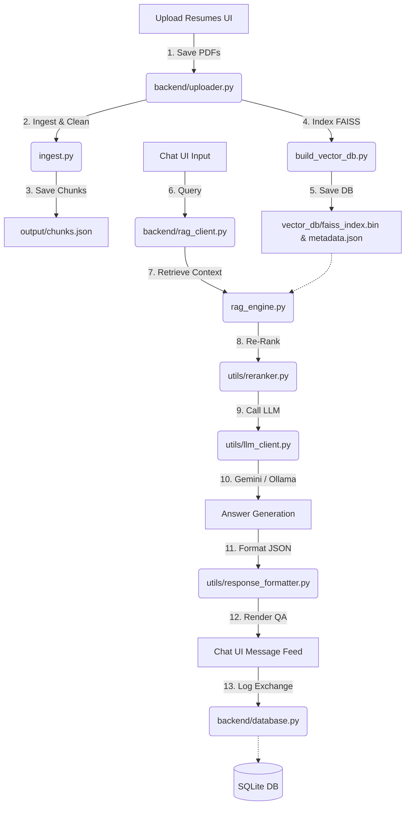

# Resume RAG System (End-to-End Production Application)

This repository contains the complete, production-ready implementation of a **Resume Retrieval-Augmented Generation (RAG) System** encompassing all 4 development roles:
- **Member 1 (Data Ingestion)**: Extracts text from PDFs using PyMuPDF (`fitz`), cleans formatting, and configures exactly 1 chunk per resume.
- **Member 2 (Embedding & Vector DB)**: Computes dense embeddings using `BAAI/bge-small-en-v1.5` and compiles them inside a FAISS vector store.
- **Member 3 (RAG Inference Pipeline)**: Performs Cosine Similarity retrieval, re-ranks retrieved contexts using a Cross-Encoder, and runs queries against local Ollama services or the cloud Google Gemini API.
- **Member 4 (Frontend UI Dashboard & Chat)**: User-facing dashboard interface built on Streamlit with SQLite session history logs and file upload pipelines.

---

## Folder Structure

```text
Resume-RAG/
├── data/
│   └── resumes/              # Storage directory containing candidate PDF resumes
├── output/
│   └── chunks.json           # Member 1 output: serialized text chunks and metadata
├── vector_db/
│   ├── faiss_index.bin       # Member 2 output: FAISS vector database index binary
│   └── metadata.json         # Member 2 output: index-aligned chunk metadata JSON
├── chat_history/
│   └── history.db            # Member 4 output: SQLite database for chat history logs
├── pages/
│   ├── Home.py               # Member 4: Dashboard stats overview and database metrics
│   ├── Upload.py             # Member 4: Multiple file drag-and-drop uploader with status bars
│   ├── Chat.py               # Member 4: Chat assistant dialog layout with citation drawers
│   └── History.py            # Member 4: Historic logs inspector with audit trail search
├── backend/
│   ├── __init__.py           # Package marker
│   ├── database.py           # Member 4: SQLite CRUD interface for sessions and files
│   ├── session_manager.py    # Member 4: Streamlit session state and UUID session manager
│   ├── rag_client.py         # Member 4: Python API bridge invoking Member 3's RAGPipeline
│   └── uploader.py           # Member 4: Programmatic pipeline running Member 1 and Member 2
├── utils/
│   ├── __init__.py           # Package marker
│   ├── pdf_loader.py         # Member 1: Reads text from PDFs using PyMuPDF (fitz)
│   ├── text_cleaner.py       # Member 1: Normalizes whitespace and clean sentences
│   ├── chunker.py            # Member 1: Returns the entire resume text as a single chunk
│   ├── metadata.py           # Member 1: Candidate name and chunk metadata utilities
│   ├── data_loader.py        # Member 2: Loads and validates chunks.json
│   ├── embedding_model.py    # Member 2: Singleton SentenceTransformer embedding engine
│   ├── vector_store.py       # Member 2: FAISS index creation and serialization
│   ├── query_embedder.py     # Member 3: Encodes user questions using BGE-small
│   ├── retriever.py          # Member 3: Loads index and retrieves Top-K chunks
│   ├── reranker.py           # Member 3: Scores matches using a Cross-Encoder
│   ├── prompt_builder.py     # Member 3: Constructs the grounded system prompt
│   └── llm_client.py         # Member 3: Local Ollama / Gemini API request broker
├── assets/
│   └── style.css             # Member 4: Custom CSS stylesheet for bubbles and cards
├── config.py                 # Central configurations (paths, models, generation parameters)
├── ingest.py                 # Member 1: Data ingestion pipeline orchestrator
├── build_vector_db.py        # Member 2: Vector database builder orchestrator
├── rag_engine.py             # Member 3: Main query pipeline & interactive shell
├── app.py                    # Member 4: Main Streamlit dashboard app orchestrator
├── requirements.txt          # Unified project requirements list
└── README.md                 # Unified project documentation
```

---

## Architecture Flow



---

## Installation & Setup

### Prerequisites
- Python 3.10 or Python 3.11
- Pip package manager

### Step 1: Install Dependencies
```bash
pip install -r requirements.txt
```

### Step 2: Configure LLM Backend
1. **Google Gemini (Default)**:
   Set your Google Gemini API key as an environment variable before running the app:
   ```bash
   set GEMINI_API_KEY=your_api_key_here
   ```
   
2. **Local Ollama (Alternative)**:
   If you want to use local models, ensure Ollama is active (`ollama serve`) and pull the model:
   ```bash
   ollama pull llama3
   ```
   You can select between Ollama and Gemini on-the-fly in the sidebar of the Streamlit application.

---

## Running the Application

To launch the full user-facing Streamlit application, run:
```bash
streamlit run app.py
```
This will start the Streamlit server and automatically open the application inside your web browser (typically at `http://localhost:8501`).

---

## Features Walkthrough

### 1. Dashboard (Dashboard Tab)
Provides a clean dashboard showing general metrics:
- Number of resumes in database
- Total character chunks indexed
- Embedding dimension (384)
- Details about vector store compilation and active LLM model tags.
- Candidate index list with file sizes and indexed dates.

### 2. Resume Upload (Upload Resumes Tab)
Allows dragging and dropping multiple PDF resumes:
- Validates that the uploads are PDFs and within the 10MB file size limit.
- Checks and ignores duplicate files (same size/hash).
- Displays step-by-step progress bars showing ingestion extraction, embedding generation, FAISS indexing, and registry caching.

### 3. Chat Room (Chat Assistant Tab)
ChatGPT-style conversation dialogue box:
- Allows asking QA queries (e.g., *"What skills does Abduljaha Parchuru have?"*).
- Displays similarity scores and expandable content cards showing matching resume excerpts.
- Features a **Clear Conversation** reset option.
- Includes a **Download Chat Session History** button to export session logs as JSON files.

### 4. Conversation Audit Logs (Conversation Logs Tab)
Audit screen displaying historical records:
- Provides a global keyword search filter across all historic QA exchanges.
- Displays conversation logs with restored model configs and timestamps.
- Exposes a **Restore Session to Chat Page** function to reload historical logs into the chat UI page.
- Exposes a **Delete Session Log** control to purge entries from the SQLite store.

---

## Error Handling & Security
- **Type Checking**: File uploads are restricted to `.pdf`.
- **Duplicate Prevention**: Uploads with identical filenames and file sizes are skipped automatically to prevent redundant vector indexing.
- **Fail-Safe Fallbacks**: If the Cross-Encoder re-ranker fails to compile, it falls back to raw FAISS cos-sim scoring gracefully.
- **Connection Checks**: LLM clients perform pre-flight checks to determine whether Ollama or Gemini hosts are reachable before launching queries.
